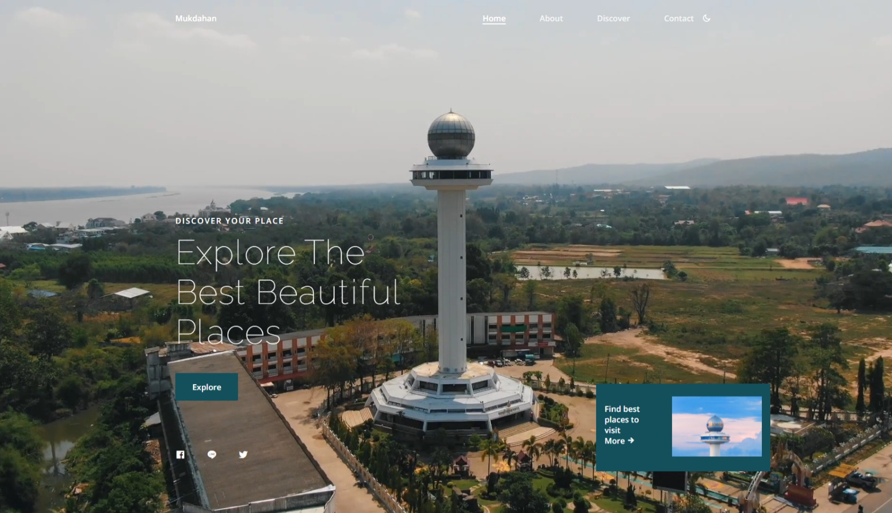

## 📌 Mukdahan-discover Project

This project was created to learn and promote tourism in Mukdahan Province.

## 🚀 Quick start

1. Clone this repo:

```bash
git clone https://github.com/alohadancemeow/next-travel-102.git
```

2. Install lib.

```bash
npm install
```

3. Run

```bash
npm run dev
```

#### :memo: Using :

- [styled-components](https://styled-components.com/)
- [remixicon](https://remixicon.com/)
- [react-scroll](https://www.npmjs.com/package/react-scroll)
- [react-share](https://www.npmjs.com/package/react-share)
- [swiper](https://swiperjs.com/)
- [aos](https://michalsnik.github.io/aos/)

#### :tada: Screenshot



#### :wave: Live site

[Mukdahan](https://mukdahan-discover.vercel.app/)
